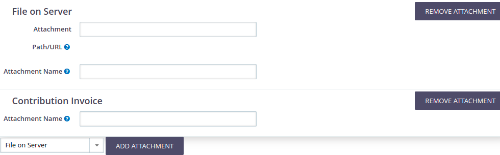

# Usage

## Using the attachments form

The form widget provided by _Mail Attachments_ can be embedded into any CivICRM
form by extension developers, making it easy for users by always presenting them
with the same user interface when it comes to e-mail attachments.

The form widget allows users to add as many attachments as they want in an Ajax-
powered manner without the need of re-submitting the form in-between, and also
removing them.

Each attachment can have specific form elements, such as the path for existing
files for _File on Server_ type attachments, or an *Attachment Name* field for
specifying the file name of the attachment in the resulting e-mail. There may
also be attachments types without any input fields.

Adding attachments is done by selecting the attachment type from the drop-down
field and clicking the _Add Attachment_ button, which results in another
attachment being added to the list, and configuring this attachment
appropriately.

After submitting the entire form, each attachment type implementation takes care
of processing their input and attaching a file to the e-mail being sent by the
form.
